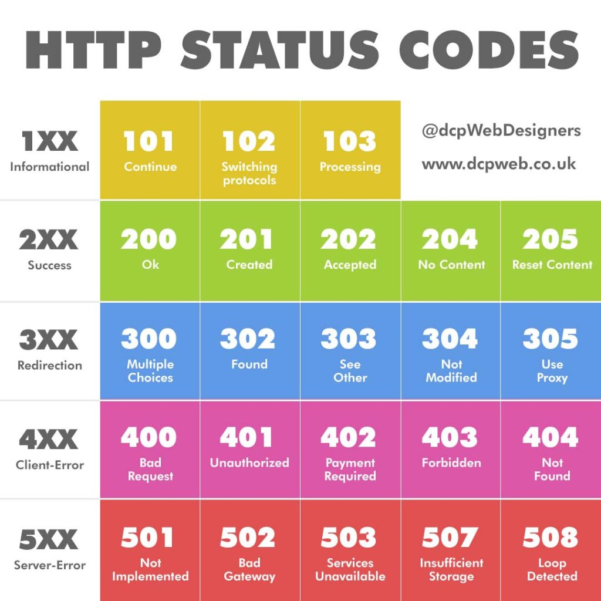

# Основы протокола HTTP
---
### HTTP в стеке протоколов TCP/IP
Протокол HTTP относится к **прикладному уровню (Application)** стека TCP/IP.

- **Application:** DNS, FTP, HTTP, IMAP, POP, SMTP, SSH, TLS/SSL и др.
- **Transport:** TCP, UDP и др.
- **Internet:** IP (IPv4, IPv6), ICMP, IPsec и др.
- **Link:** Ethernet, PPP и др.

HTTP определяет правила обмена данными на уровне приложения. HTTP/1.1 и HTTP/2 обычно работают поверх TCP, а HTTP/3 — поверх QUIC, использующего UDP.

---
### HTTP в стеке протоколов TCP/IP


---
### Версии протокола HTTP
- **HTTP/0.9** — 1990–1991 гг. (очень простая версия, только `GET`, без заголовков).
- **HTTP/1.0** — 1996 г. (заголовки, новые методы, поддержка различных типов данных).
- **HTTP/1.1** — 1997–1999 гг. (постоянные соединения, `Host`, chunked transfer и др.).
- **HTTP/2** — 2015 г. (бинарное фреймирование, сжатие заголовков, мультиплексирование нескольких запросов по одному соединению).
- **HTTP/3** — 2022 г. (передача поверх **QUIC** вместо TCP).
- 💡 **Важно:** HTTP/2 и HTTP/3 сохраняют основные семантики HTTP (методы, статусы, заголовки и т.д.), меняя прежде всего способ передачи и фреймирования сообщений.

---
### Проблема HTTP/1.1 и решение в HTTP/2
- HTTP/1.1 не имеет встроенного мультиплексирования. Для параллельной загрузки ресурсов браузеры обычно используют **несколько TCP-соединений**. При последовательной обработке запросов также возникает проблема *Head-of-Line (HOL) blocking*: один медленный запрос может задерживать следующие.
- **HTTP/2 использует мультиплексирование:**
несколько запросов и ответов разбиваются на фреймы и передаются вперемешку по **одному TCP-соединению**. Поэтому медленный HTTP-запрос не блокирует другие запросы на уровне HTTP/2.
- ⚠️ **Но:** HTTP/2 всё ещё работает поверх TCP. Потеря TCP-пакета может временно задержать все потоки этого соединения. HTTP/3 использует независимые QUIC-потоки.

---
### Проблема HTTP/1.1 и решение в HTTP/2


---
### HTTPS (HTTP Secure)
- Обычный HTTP не обеспечивает конфиденциальность и целостность передаваемых данных. Данные могут быть прочитаны или изменены злоумышленником на пути передачи.
- **HTTPS = HTTP поверх TLS**
  - Трафик шифруется.
  - TLS обеспечивает проверку подлинности сервера с помощью сертификата.
  - Обеспечивается целостность передаваемых данных.
  - В современном вебе HTTPS используется практически повсеместно.
  - 💡 В HTTP/3 защита обеспечивается TLS 1.3 внутри QUIC.


---
### Программное обеспечение (Участники процесса)
- **Исходные серверы (Origin Servers)** — хранят ресурсы и обрабатывают запросы.
- **Клиенты** — браузеры, менеджеры закачек, поисковые роботы/краулеры и другие HTTP-клиенты.
- **Прокси и кэши** — промежуточные компоненты, которые могут выполнять фильтрацию, кэширование, пересылку запросов и распределение нагрузки.


---
### Структура сообщений протокола
Для **HTTP/1.1** сообщение состоит из:
1. **Стартовой строки (Start Line)** — определяет тип сообщения: запрос или ответ.
2. **Заголовков (Headers)** — передают метаданные и параметры обработки сообщения.
3. **Тела сообщения (Message Body)** — передаваемые данные, если они есть.
- Заголовки отделяются от тела пустой строкой (`CRLF CRLF`).
- Сообщения делятся на две группы: **запросы** и **ответы**.
- 💡 Эта текстовая структура относится прежде всего к HTTP/1.x. В HTTP/2 и HTTP/3 данные передаются в бинарных фреймах, хотя семантика запросов, ответов, заголовков и тела сохраняется.

---
### Структура сообщений протокола


---
### Запросы: Методы и их свойства
Формат стартовой строки HTTP/1.1:
Метод URI HTTP/Версия

**Важные свойства методов:**
- **Safe (безопасный)** — метод не предназначен для изменения состояния ресурса.
- **Idempotent (идемпотентный)** — многократное выполнение одинакового запроса имеет тот же *предполагаемый эффект*, что и однократное выполнение.
> 💡 Идемпотентность не означает, что сервер обязательно вернёт одинаковый ответ. Речь идёт об ожидаемом эффекте повторения операции.

---
### Запросы: Методы и их свойства
**Основные методы:**
- `GET` — получить представление ресурса (**Safe, Idempotent**)
- `POST` — передать данные для обработки (**не Safe, не Idempotent**)
- `PUT` — создать или полностью заменить представление ресурса (**Idempotent**)
- `PATCH` — частично изменить ресурс (**не обязательно Idempotent**)
- `DELETE` — удалить ресурс (**Idempotent**)
- `HEAD` — получить только заголовки, соответствующие `GET` (**Safe, Idempotent**)
- `OPTIONS` — узнать доступные возможности ресурса или сервера (**Safe, Idempotent**)

---
### Пример: Запрос GET
```http
GET /wiki/страница HTTP/1.1
Host: ru.wikipedia.org
User-Agent: Mozilla/5.0
Accept: text/html
Connection: close
```

*Заголовок `Host` обязателен в HTTP/1.1. Он позволяет одному IP-адресу обслуживать несколько виртуальных хостов.*

---
### Ответы: Стартовая строка и статусы
Формат стартовой строки ответа HTTP/1.1:
- `HTTP/Версия КодСостояния Пояснение`

Классы кодов состояния:
- **1xx (Informational)** — информационные ответы.
- **2xx (Success)** — запрос успешно обработан (например, `200 OK`).
- **3xx (Redirection)** — требуется дополнительное действие (например, `301`, `302`).
- **4xx (Client Error)** — ошибка, связанная с запросом клиента (например, `400`, `403`, `404`).
- **5xx (Server Error)** — ошибка при обработке запроса на сервере (например, `500`, `502`, `503`).

---
### Коды состояний HTTP


---
### Пример: Ответ HTTP/1.1 200 OK
```http
HTTP/1.1 200 OK
Date: Wed, 11 Feb 2009 11:20:59 GMT
Server: Apache
Last-Modified: Wed, 11 Feb 2009 11:20:59 GMT
Content-Language: ru
Content-Type: text/html; charset=utf-8
Content-Length: 1234
Connection: close

(далее следует запрошенная страница в HTML)
```

> 💡 `Content-Type` сообщает тип передаваемых данных, а `Content-Length` — их размер в байтах.

---
### Пример: Запрос POST
```http
POST /login HTTP/1.1
Host: www.example.com
Content-Type: application/x-www-form-urlencoded
Content-Length: 49

email=test%40test.com&password=secure&login=login
```

*Тело запроса отделено пустой строкой от заголовков. `Content-Length` указывает размер тела сообщения в байтах.*

---
### Механизм HTTP Cookie
- HTTP по своей модели **stateless**: сервер не обязан хранить состояние предыдущих запросов клиента.
- Для связывания нескольких запросов с одним клиентом часто используются **Cookies**:

1. Сервер отправляет заголовок `Set-Cookie` в ответе.
2. Браузер сохраняет cookie с указанными атрибутами.
3. При последующих подходящих запросах браузер отправляет заголовок `Cookie`.

---
### Механизм HTTP Cookie
Запрос 1
```http
GET /index.html HTTP/1.1
Host: www.example.org
```
Ответ сервера
```http
HTTP/1.1 200 OK
Set-Cookie: session_id=abc123; Secure; HttpOnly
```
Запрос 2
```http
GET /index.html HTTP/1.1
Host: www.example.org
Cookie: session_id=abc123
```


---
### Другие возможности: Докачка и кэширование
**Range-запросы:**
Позволяют получать часть ресурса — например, для докачки большого файла.

```http
GET /conf-2009.avi HTTP/1.1
Range: bytes=64397516-80496894
```

*Ответ: `206 Partial Content` с заголовком `Content-Range`.*

**Условные GET:**
Позволяют не передавать ресурс заново, если он не изменился.

```http
GET /index.html HTTP/1.1
If-Modified-Since: Wed, 21 Apr 2010 12:33:42 GMT
```

*Если ресурс не изменился: `304 Not Modified`.*
- 💡 На практике для валидации кэша также широко используется `ETag` вместе с `If-None-Match`.

---
### Другие возможности: Multipart и авторизация
- **Multipart/form-data:**
Используется, в частности, для отправки файлов через HTML-формы. Тело запроса разбивается на части с помощью специального разделителя (`boundary`).

```http
Content-Type: multipart/form-data; boundary=----WebKitFormBoundary

------WebKitFormBoundary
Content-Disposition: form-data; name="file"; filename="photo.jpg"
Content-Type: image/jpeg

...данные файла...
------WebKitFormBoundary--
```

---
### Другие возможности: Multipart и авторизация
- **HTTP Basic Authentication:**
Сервер может потребовать аутентификацию, ответив `401 Unauthorized` и указав схему
- ⚠️ **ВНИМАНИЕ:** Base64 — это *кодировка*, а не шифрование! Basic Authentication следует использовать только поверх защищённого HTTPS-соединения.

---
### HTTP Basic Authentication

Запрос клиента:
```http
GET /private/index.html HTTP/1.1
Host: localhost
```
Ответ сервера:
```http
HTTP/1.1 401 Unauthorized
WWW-Authenticate: Basic realm="Secure Area"
```
Клиент передаёт:

```http
Authorization: Basic base64(login:password)
```
  


---
### Безопасность в браузере: CORS
- Браузеры применяют **Same-Origin Policy** — политику, ограничивающую доступ скриптов к ресурсам другого origin.
- **Origin** определяется комбинацией:
`схема + хост + порт`
- Например, JavaScript, загруженный с `https://site.com`, не может произвольно прочитать ответ `https://api.other-site.com`.

---
### Безопасность в браузере: CORS
- **Как это решается (CORS — Cross-Origin Resource Sharing):**
Сервер сообщает браузеру, какие origin могут получить доступ к ответу:

```http
Access-Control-Allow-Origin: https://site.com
```
- Для публичного ресурса без credentials может использоваться:

```http
Access-Control-Allow-Origin: *
```

- 💡 При некоторых cross-origin запросах браузер сначала выполняет **preflight-запрос `OPTIONS`**, чтобы проверить разрешённые методы и заголовки.
- *Если сервер не разрешил доступ через CORS, браузер может заблокировать доступ JavaScript к ответу, даже если сервер сам успешно обработал HTTP-запрос.*

---
### Практика: HTTP-взаимодействие через Telnet
- HTTP/1.1 в текстовом виде можно отправить веб-серверу вручную, без браузера.
- **Алгоритм для Windows:**
  - Установить клиент Telnet: «Панель управления → Программы и компоненты → Компоненты Windows → Клиент Telnet» (по умолчанию отключён).
  - Запустить консоль (`Win+R` → `cmd`).
  - Подключиться:
   `telnet example.com 80`
  - Ввести запрос:

```http
GET / HTTP/1.1
Host: example.com

```
  - В конце нажать Enter дважды — пустая строка завершает заголовки.
  - 💡 `telnet` удобен для демонстрации HTTP/1.1. Он не подходит для HTTPS, поскольку не выполняет TLS-рукопожатие.
---
### Практика: HTTP-взаимодействие через Telnet


