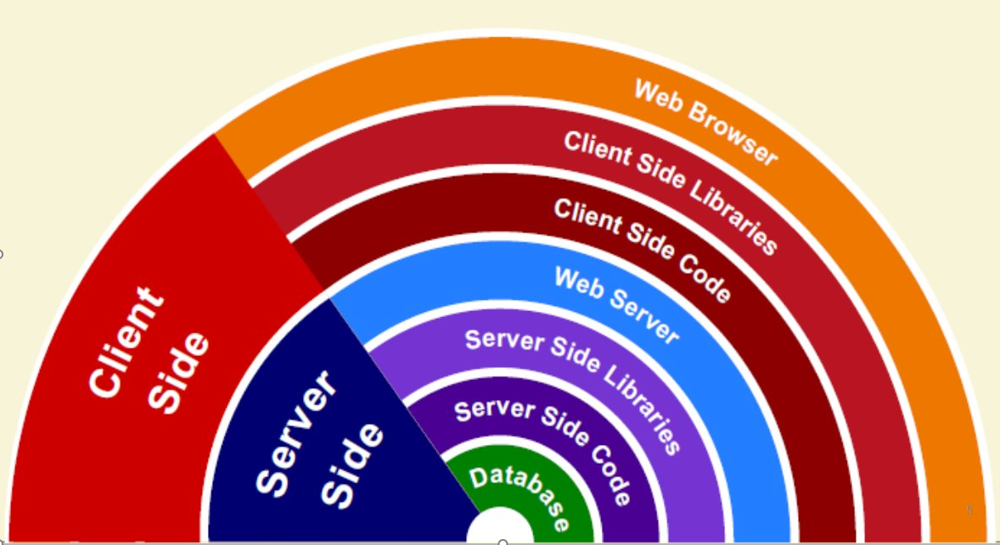

# Server Side Programming
---
### Стек технологий

---
### 
 - Почему нам не хватает возможностей HTML?
    - Нам нужен **динамически** меняющийся контент на странице с **динамически** изменяющейся структурой страницы
 - Но почему нам не хватает JavaScript?
     - Часто сам контент генерируется **динамически**, в момент запроса. Следовательно должен быть **компонент системы**, который его генерирует 
---
### Схема типичного приложения


https://developer.mozilla.org/en-US/docs/Learn/Server-side/First_steps/Introduction/web_application_with_html_and_steps.png
---
### 
 - Чем отличается программирование на сервере от программирования на клиенте:
     - Различные задачи  (и проблемы).
     - Обычно разные языки программирования (исключение - JavaScript, который может использоваться и на сервере и на стороне клиента).
     - Они работают в разных «средах»
---
### Как запустить программу на сервере. CGI
 - CGI (Common Gateway Interface ) является стандартом интерфейса внешней прикладной программы с WWW сервером.
 - CGI-программа - это обычная программа, которая выполняется на Web-сервере в ответ на запрос, сделанный браузером. Для написания такой программы можно использовать почти любой язык программирования - CGI определяет стандарт интерфейса между Web-сервером и CGI-программой. 
---
### Подходы. CGI
 - CGI-программа может возвращать данные любого типа, например HTML-текст, рисунки в формате GIF, проcтой текст, документы Microsoft Word, аудоифайлы и т.д. 
 - Заголовок типа возвращаемых данных сообщает браузеру о типе данных, для того чтобы обеспечивать их правильную обработку.
 - Если Web-сервер может запустить программу на выполнение и если программа возвращает правильные данные, она может быть использована в качестве CGI-программы
---
### Спецификация CGI
 - CGI определяет 4 информационных потока.
     - Переменные окружения
     - Стандартный входной поток
     - Стандартный выходной поток 
     - Командная строка


             - https://dit.isuct.ru/IVT/BOOKS/DBMS/DBMS1/_pic_/cgi.gif

---
### Переменные окружения
 - SERVER_NAME
 - CONTENT_LENGTH значение этой переменной соответствует длине стандартного входного потока в символах.
 - REQUEST_METHOD метод запроса, который был использован "POST","GET","HEAD" и т.д.
 - QUERY_STRING значение этой переменной соответствует строке символов следующей за знаком "?" в URL соответствующему данному запросу. Эта информация не декодируется сервером.
 - … и много других
---
### Стандартный вывод
 - СGI - модуль выводит информацию в стандартный выходной поток. Этот вывод может представлять собой или документ, сгенерированный cgi-модулем, или инструкцию серверу, где получить необходимый документ. Обычно cgi-модуль производит свой вывод. Преимущество такого подхода в том, что cgi-модуль не должен формировать полный HTTP заголовок на каждый запрос.
 - Вывод cgi-модуля должен начинаться с заголовка содержащего определенные строки и завершаться двумя символами CR(0x10).
 - Любые строки не являющиеся директивами сервера, посылаются непосредственно клиенту.
---
### Стандартный ввод
 - В случае метода запроса POST данные передаются как содержимое HTTP запроса в стандартный входной поток.
 - Данные передаются cgi-модулю в следующей форме:
```html 
    name=value&name1=value1&...&nameN=valueN 
```
 - На файловый дескриптор стандартного потока ввода посылается CONTENT_LENGTH байт. Так же сервер передает cgi-модулю CONTENT_TYPE (тип данных). Сервер не посылает символ конца файла после передачи CONTENT_LENGTH байт данных или после того, как cgi-модуль их прочитает. 
 - В случае метода GET, строка данных передается как часть URL.  Для этого устанавливается переменная окружения QUERY_STRING вида 
```html
    name1=value1&name2=value2
```
---
### Пример 1. Демонстрация
http://localhost:8080/cgi-bin/list.bat
---
### Пример 1
 - Запуск
 - Stdin, stdout – НЕТ
 - Переменных окружения - НЕТ
```bash 
@echo off
echo Content-type: text/html
echo.
echo ^<html^>^<body^>^<h2^>Hello World!^</h2^>^<pre^>
dir /b
echo ^</pre^>^</body^>^</html^>
```
---
### Пример 2. Демонстрация
http://localhost:8080/cgi-bin/HelloCGI.exe
---
### Пример 2
```c 
#include <stdio.h>

int main(int arcg, char* argv[]){
    printf("Content-type: text/html%c%c",10,10); 
    printf("<h1>HelloWorld</h1>\n\n");
    //printf("REQUEST_METHOD=%s",getenv("REQUEST_METHOD"));
    return 0;
}
```
---
### Пример 3. Демонстрация
 - Передача параметров (метод GET)
 - Работа через переменные окружения

http://localhost:8080/form_get.html
---
### Пример 3
```c 
int main(int arcg, char* argv[]){
    entry entries[MAX_ENTRIES]; 
    printf("Content-type: text/html%c%c",10,10); 
    printf("<h1>HelloWorld</h1>\n\n");
    printf("<h2>QUERY_STRING=%s</h2>",getenv("QUERY_STRING"));
    int cl = strlen(getenv("QUERY_STRING")); 
    int x,m;
        for(x=0;cl;x++){ 
            m=x;
            entries[x].val = fmakeword(getenv("QUERY_STRING"),'&',&cl); 
            plustospace(entries[x].val); 
            unescape_url(entries[x].val); 
            entries[x].name = makeword(entries[x].val,'='); 
        } 
    printf("<H1>Query Results</H1>"); 
    printf("You submitted the following name/value tags:<p>%c",10); 
    printf("<ul>%c",10); 
    for(x=0; x <= m; x++) printf("<li> <code>%s = %s</code>%c",entries[x].name, 
                                                        entries[x].val,10); 
    printf("</ul>%c",10); return 0;
}
```
---
### Пример 4. Демонстрация
 - Передача параметров (метод POST)
 - Работа через стандартный поток ввода

http://localhost:8080/tests/form_post.html
---
### Пример 4
```c 
int main(int arcg, char* argv[]){
    entry entries[MAX_ENTRIES]; 
    printf("Content-type: text/html%c%c",10,10); 
    printf("<h1>HelloWorld</h1>\n\n");
    int cl = atoi(getenv("CONTENT_LENGTH")); 
    int x,m;
    for(x=0;cl && (!feof(stdin));x++){
        m=x;
        entries[x].val = fmakeword(stdin,'&',&cl); 
        plustospace(entries[x].val); 
        unescape_url(entries[x].val); 
        entries[x].name = makeword(entries[x].val,'='); 
    } 
    printf("<H1>Query Results</H1>"); 
    printf("You submitted the following name/value pairs:<p>%c",10); 
    printf("<ul>%c",10); 
    for(x=0; x <= m; x++) printf("<li> <code>%s = %s</code>%c",entries[x].name, 
                                                            entries[x].val,10); 
    printf("</ul>%c",10); 
    return 0;
}
```
---
### Проблемы “чистого” CGI и пути их решения
 - Код HTML «встроен» в код программы
     - Сложность поддержки
     - Сложность разработки
 - Решение: использовать шаблоны и обрабатывать их в CGI
---
### Шаблоны
```html
<html>
    <head>
       <title>#!TITLE!#</title>
    </head> 
    <body>
       <div id="menu">#!MENU!#</div>
       <div id="content">#!TEXT!#</div>
    </body>
  </html>
```
---
### Шаблоны
 - Использование шаблонов решает часть проблем - отделяет разметку от логики формирования данных
 - При  практическом использовании шаблонов возникает желание строить «сложные» шаблоны. Как результат появляются специальные языки управления шаблонами
 - Следующий логический шаг – встроить в шаблоны полнофункциональный язык программирования. Типичные представители подхода – php, jsp, asp, …
---
### Java Server Pages
 - JSP – это технология, которая упрощает создание web страниц (и не только) с динамически изменяющимся (во время генерации страницы) содержимым
 - JSP файл – это текстовый документ, содержимое которого можно разбить на две части
     - статический текст (каркас) – создается при помощи специальных редакторов
     - динамический (генерируемый во время выполнения страницы) – обычно пишется в среде разработки программирования
---
### Пример 5. JSP
http://localhost:8080/tests/ex1.jsp
---
### Принцип работы

https://findout.su/findoutsu/baza3/1203618253253.files/image004.png
---
### Трансляция JSP-файла
 - JSP-файл транслируется в файл java
 - Процесс трансляции управляется директивами 
**(<%@ page […] %>)**
 - Полученный файл компилируется в класс **сервлета** (класса Java, специального вида, работающего под управлением сервера)

---
### Создание страницы
 - Создание статического содержимого. Для этого удобно использовать редакторы HTML, XML и пр.
 - Вставка динамических объектов и элементов сценариев JSP. В созданный файл вставляются элементы 
 **<%? […] %>**
---
### Элементы JSP-страницы
 - Статический текст
 - Элементы сценариев:
     - Комментарии  **<%-- [] --%>**
     - Объявления   **<%! [] %>**  
     - Скриплеты    **<% [] %>**
     - Выражения    **<%= [] %>**
     - Директивы    **<%@ ? [] %>**
 - Стандартные объекты
---
### JSP-страница с комментариями
 - JSP-страница 
```html 
<html><body>
  Hello World!
  <%-- This is a JSP comment --%>
  <!-- This is a HTML comment -->
</body></html>
```
 - Фрагмент примерного кода сервлета
```java 
out.write("<html><body>\n  Hello World!\n  ");
out.write("\n  <!-- This is a HTML comment -->"
           + "\n</body></html>\n");
``` 
---
### Объявления
**<%! […] %>**
 - Обычно содержат объявления переменных, методов, классов и интерфейсов
 - При трансляции преобразуются в элементы класса сервлета (поля, методы и вложенные типы)
 - Нельзя использовать поля для хранения значений, использующихся в рамках одного запроса
 - При работе с внутренними классами есть особенности
---
### JSP-страница с объявлениями
 - JSP-страница 
```js 
<%!
    private String str = "Message: ";
    public String createMessage(String arg) {
        return str + arg;
    }
%>
```
 - Фрагмент примерного кода сервлета 
```java 
public final class index_jsp extends org.apache.jasper.runtime.HttpJspBase
  implements org.apache.jasper.runtime.JspSourceDependent {
    private String str = "Message: ";
    public String createMessage(String arg) {
        return str + arg;
    }
``` 
---
### Скриптлеты
**<% […] %>**
 - Содержат динамически выполняемый код
 - Преобразуются во фрагменты методов сервлета, формирующих отклик
 - Синтаксически являются фрагментами обычных Java-методов
 - Каждая завершенная инструкция заканчивается знаком точки с запятой
---
### JSP-страница со скриптлетами
 - JSP-страница 
```html 
<html><body>
<%  String server_name = System.getProperty("os.name");
    if (server_name == null)
      server_name = "Undefined.";  %>
</body></html>
```
 - Фрагмент примерного кода сервлета 
```java 
out.write("<html><body>\n");
String server_name = System.getProperty("os.name");
if (server_name == null) 
  server_name = "Undefined.";  
out.write("\n");
out.write("</body></html>\n");
``` 
---
### Выражения
**<%= […] %>**
 - Содержит выражения, значения которых будут выведены в отклик
 - Синтаксически являются вычислимыми выражениями Java, для которых может быть получено текстовое представление
 - В конце выражений точки с запятой нет!
---
### JSP-страница с выражениями
 - JSP-страница 
```html 
<html><body>
OS Name: <%=server_name%>
<br><%=createMessage("It works!")%>
</body></html>
```
 - Фрагмент примерного кода сервлета 
```java 
out.write("<html><body>\n");
out.write("OS Name: ");
out.print(server_name);
out.write("\n");
out.write("<br>");
out.print(createMessage("It works!"));
out.write("\n");
out.write("</body></html>\n");
``` 
---
### Директива page
**<%@ page […] %>**
 - Позволяет управлять процессом трансляции JSP-страницы в сервлет
 - Часто используемые параметры
     - Тип отклика и кодировка
     - Автоматическая инициализация сессии
     - Импортируемые типы
     - Страница для обработки ошибок
         - Является ли данная страница обработчиком
         - Какая страница используется как обработчик
---
### Тип отклика, кодировка и импорт типов
 - JSP-страница 
```html 
<%@page contentType="text/html; charset=UTF-8"%>
<%@page session="true"%>
<%@page import="java.util.*, java.lang.reflect.*" %>
```
 - Фрагмент примерного кода сервлета 
```java 
import java.util.*;
import java.lang.reflect.*;
...
  response.setContentType("text/html; charset=UTF-8");
  session = pageContext.getSession();
...
``` 
---
### Обработка ошибок (JSP-страницы)
 - Основная страница 
```html 
<%@page contentType="text/html; charset=UTF-8"%>
<%@page errorPage="errorMessage.jsp"%>
<html><body>
<% if(true) throw new Exception("Something happened!");%>
</body></html>
```
 - Страница-обработчик 
```html 
<%@page contentType="text/html" pageEncoding="UTF-8"%>
<%@page isErrorPage="true" %>
<html><body>
An error has occurred! Please, contact administrator.
<%someLogMethod(exception);%>
</body></html>
``` 
---
### Стандартные объекты
 - **page** ссылка на текущий объект (по сути – объект сервлета)
 - **config** имеет тип javax.servlet.ServletConfig, позволяет получить контекст сервлета и параметры сервлета
 - **application** имеет тип javax.servlet.ServletContext, определяет контекст сервлета
 - **pageContext** имеет тип javax.servlet.jsp.PageContext, определяет контекст jsp-страницы
---
### Стандартные объекты
 - **session** имеет тип javax.servlet.http.HttpSession, представляет текущую сессию
 - **request** имеет тип javax.servlet.http.HttpServletRequest, представляет текущий запрос
 - **response** имеет тип javax.servlet.http.HttpServletResponse, представляет текущий отклик
 - **out** имеет тип javax.servlet.jsp.JspWriter, представляет поток для вывода, по функциональности схож с классом PrintWriter
---
### Пример 6. Демонстрация​
http://localhost:8080/tests/form_get_jsp.html
http://localhost:8080/tests/form_post_jsp.html
---
### Пример 6
```js 
<body> 
    <%@page pageEncoding="UTF-8"%> 
    <h1> Список параметров, переданных на страницу</h1>
    <%
        request.setCharacterEncoding("UTF-8");
        java.util.Enumeration<String> names = request.getParameterNames();
    %>
    <table>
        <tr><th>Имя</th> <th>Значение</th></tr>
        <%while (names.hasMoreElements()) {
            String name = names.nextElement();
            String value = request.getParameter(name);
        %>
        <tr>
            <td><%= name%></td>
            <td><%= value%></td> 
        </tr>
        <%
        }
        %>
    <table>  
</body>
```